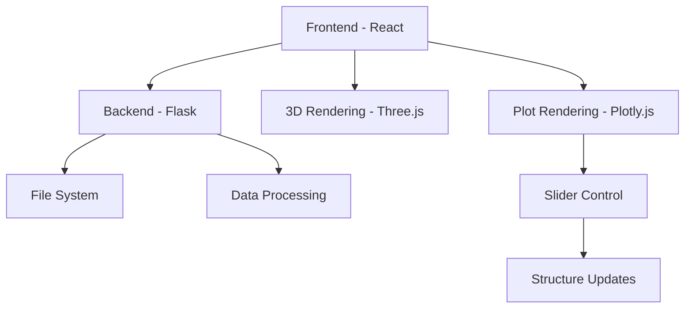
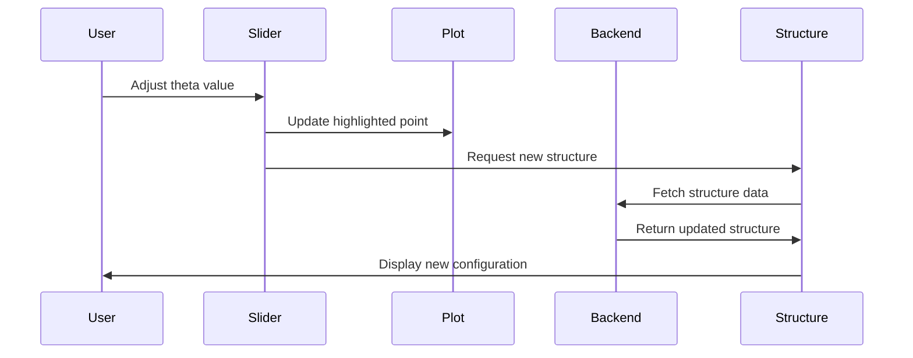

# Technical Design Document (TDD)

## Architecture

## Components
1. Backend (Flask)
   - Serves molecular structure data
   - Handles file operations
   - Processes plot data

2. Frontend (React)
   - Plot visualization with slider control
   - 3D molecular structure rendering
   - User interface controls
   - Real-time structure updates

## Data Flow
